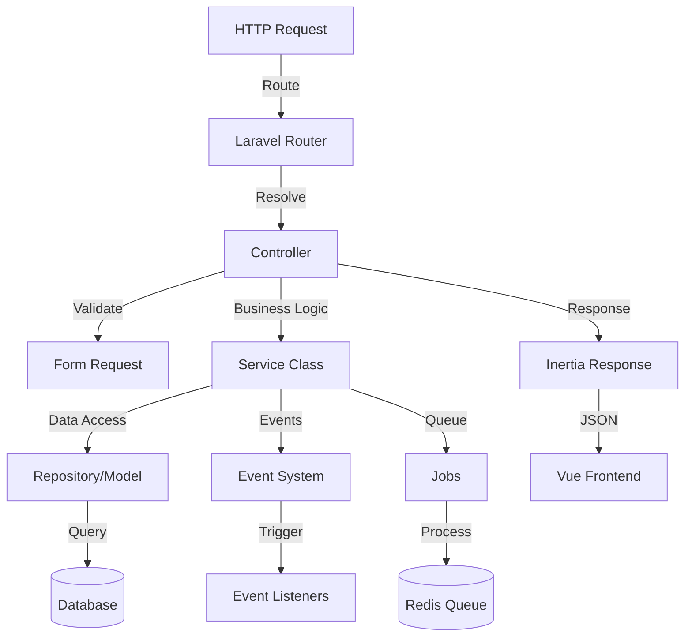

# Backend Architecture

Saucebase is built on Laravel 13 with a modular architecture. This guide covers what's unique to Saucebase — for standard Laravel patterns, see the [Laravel Documentation](https://laravel.com/docs).

## Architecture Overview



## Service Providers

Service providers are the central place for bootstrapping application and module components.

### AppServiceProvider

Handles core application configuration:

```php
class AppServiceProvider extends ServiceProvider
{
    public function boot(): void
    {
        // Force HTTPS in production/staging
        if (in_array(config('app.env'), ['production', 'staging'])) {
            URL::forceScheme('https');
            $this->enableHttpsSecurityHeaders();
        }

        // Fix module event discovery
        Event::clearResolvedInstance(DiscoverEvents::class);
    }

    protected function enableHttpsSecurityHeaders(): void
    {
        Response::macro('withSecurityHeaders', function () {
            return $this
                ->header('Strict-Transport-Security', 'max-age=31536000; includeSubDomains')
                ->header('Content-Security-Policy', "upgrade-insecure-requests")
                ->header('X-Content-Type-Options', 'nosniff');
        });
    }
}
```

### MacroServiceProvider

Centralized macro management:

```php
class MacroServiceProvider extends ServiceProvider
{
    public function boot(): void
    {
        $this->registerInertiaMacros();
    }

    protected function registerInertiaMacros(): void
    {
        // Enable SSR for specific response
        InertiaResponse::macro('withSSR', function () {
            Config::set('inertia.ssr.enabled', true);
            return $this;
        });

        // Disable SSR for specific response
        InertiaResponse::macro('withoutSSR', function () {
            Config::set('inertia.ssr.enabled', false);
            return $this;
        });
    }
}
```

### ModuleServiceProvider (Abstract)

Base class for module service providers. Migrations and views are auto-discovered by InterNACHI/modular — `boot()` only needs to handle translations, config, and Inertia data:

```php
abstract class ModuleServiceProvider extends ServiceProvider
{
    protected array $providers = [];

    public function boot(): void
    {
        $this->registerTranslations();
        $this->registerConfig();
        $this->shareInertiaData();
    }

    public function register(): void
    {
        foreach ($this->providers as $provider) {
            $this->app->register($provider);
        }
    }
}
```

`module_path()` is a project-level helper backed by `base_path()`, not a package-provided API.

### Module Provider Example

Every module extends `ModuleServiceProvider`, which handles translations, config, and Inertia data sharing automatically:

```php
// modules/auth/src/Providers/AuthServiceProvider.php
class AuthServiceProvider extends ModuleServiceProvider
{
    protected array $providers = [
        RouteServiceProvider::class,
    ];

    // Optional: Override boot for module-specific setup
    public function boot(): void
    {
        parent::boot(); // Always call parent

        // Add module-specific boot logic
        $this->registerEventListeners();
    }
}
```

When a module is installed, its service provider automatically registers nested providers, translations, and config. Migrations and routes are auto-discovered by the framework.

## HandleInertiaRequests Middleware

The key middleware that connects Laravel to Vue — it disables SSR by default and shares global data with all Inertia pages:

```php
class HandleInertiaRequests extends Middleware
{
    public function handle(Request $request, Closure $next): Response
    {
        // Disable SSR by default (opt-in per route)
        Config::set('inertia.ssr.enabled', false);

        return parent::handle($request, $next);
    }

    public function share(Request $request): array
    {
        return array_merge(parent::share($request), [
            'locale' => app()->getLocale(),
            'modules' => fn () => app(ModuleRegistry::class)->modules()
                ->mapWithKeys(fn ($module) => [$module->name => $module->name])
                ->all(),
            'navigation' => fn () => app(Navigation::class)->treeGrouped(),
            'breadcrumbs' => $this->getBreadcrumbs(),
            'toast' => fn () => $request->session()->pull('toast'),
            'ziggy' => fn () => [
                ...(new Ziggy)->toArray(),
                'location' => $request->url(),
            ],
        ]);
    }
}
```

This shared data is available in every Vue component via `usePage().props`.

## Next Steps

- **[Frontend Architecture](/architecture/frontend)** - How the Vue frontend consumes this data
- **[Modules Guide](/fundamentals/modules)** - Working with modules in practice
- **[SSR Guide](/fundamentals/ssr)** - How the SSR opt-in system works
