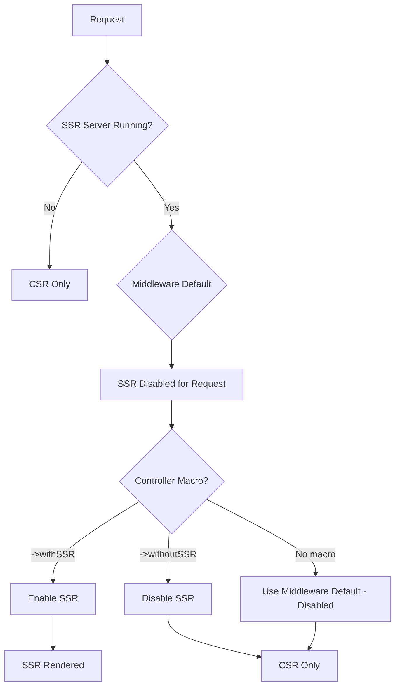

# Server-Side Rendering (SSR)

Saucebase supports optional server-side rendering (SSR) with Inertia.js, allowing you to control SSR on a per-page basis. Use SSR for public pages that need SEO, and skip it for authenticated pages for better performance.

## How SSR Works in Saucebase

Saucebase uses a **two-level SSR control system**:

1. **Boot level** (config): SSR server runs continuously
2. **Request level** (middleware): SSR disabled by default for each request
3. **Response level** (macros): Controllers opt-in with `->withSSR()` or opt-out with `->withoutSSR()`



:::tip Default Behavior
**SSR is disabled by default** via middleware. Controllers must explicitly opt-in with `->withSSR()` to enable it for specific pages.
:::

## Configuration

### Enable SSR Server

The SSR server must be enabled in configuration:

```php title="config/inertia.php"
'ssr' => [
    'enabled' => (bool) env('INERTIA_SSR_ENABLED', true),
    'url' => env('INERTIA_SSR_URL', 'http://127.0.0.1:13714'),
],
```

```env title=".env"
INERTIA_SSR_ENABLED=true
INERTIA_SSR_URL=http://127.0.0.1:13714
```

### Middleware Configuration

The `HandleInertiaRequests` middleware disables SSR by default:

```php title="app/Http/Middleware/HandleInertiaRequests.php"
public function handle(Request $request, Closure $next): Response
{
    // Disable SSR by default for all requests
    Config::set('inertia.ssr.enabled', false);

    return parent::handle($request, $next);
}
```

This ensures SSR is opt-in rather than opt-out.

## Using SSR in Controllers

### Enable SSR for a Page

Use the `->withSSR()` macro to enable SSR for public pages:

```php
use Inertia\Inertia;

class HomeController extends Controller
{
    public function index()
    {
        return Inertia::render('Index')
            ->with('products', Product::featured()->get())
            ->withSSR(); // ✅ Enable SSR for SEO
    }
}
```

### Explicitly Disable SSR

Use `->withoutSSR()` to ensure SSR is disabled:

```php
class DashboardController extends Controller
{
    public function index()
    {
        return Inertia::render('Dashboard')
            ->with('stats', $this->getUserStats())
            ->withoutSSR(); // ✅ Explicitly disable SSR
    }
}
```

### Default Behavior (No Macro)

If you don't use a macro, SSR is disabled (middleware default):

```php
class AboutController extends Controller
{
    public function index()
    {
        return Inertia::render('About');
        // SSR disabled (middleware default)
    }
}
```

## Example: E-Commerce Site

```php
class ProductController extends Controller
{
    // Public product listing - Enable SSR for SEO
    public function index()
    {
        return Inertia::render('Products/Index')
            ->with('products', Product::paginate(20))
            ->withSSR();
    }

    // Public product detail - Enable SSR for SEO
    public function show(Product $product)
    {
        return Inertia::render('Products/Show')
            ->with('product', $product->load('images', 'reviews'))
            ->withSSR();
    }

    // Admin product edit - Disable SSR (authenticated)
    public function edit(Product $product)
    {
        return Inertia::render('Products/Edit')
            ->with('product', $product)
            ->withoutSSR();
    }
}
```

## Starting the SSR Server

### Development

Start the SSR server manually:

```bash
php artisan inertia:start-ssr
```

Or run in background:

```bash
php artisan inertia:start-ssr &
```

:::tip Composer Script
The `composer dev` command automatically starts the SSR server for you!
:::

### Production

Use a process manager like Supervisor to keep the SSR server running:

```ini title="/etc/supervisor/conf.d/inertia-ssr.conf"
[program:inertia-ssr]
process_name=%(program_name)s
command=php /path/to/your/app/artisan inertia:start-ssr
autostart=true
autorestart=true
user=www-data
redirect_stderr=true
stdout_logfile=/var/log/inertia-ssr.log
```

Reload Supervisor:

```bash
sudo supervisorctl reread
sudo supervisorctl update
sudo supervisorctl start inertia-ssr
```

## Verifying SSR

### View Page Source

The easiest way to verify SSR is working:

1. Visit a page with SSR enabled
2. Right-click → "View Page Source" (Ctrl+U / Cmd+Option+U)
3. Look for rendered content inside `<div id="app" data-page="...">`

**SSR Enabled:**
```html
<div id="app" data-page="{...}">
  <div class="container">
    <h1>Welcome to Saucebase</h1>
    <p>Full HTML content here...</p>
  </div>
</div>
```

**SSR Disabled:**
```html
<div id="app" data-page="{...}"></div>
<!-- Empty div, content rendered client-side -->
```

### Check Response Headers

```bash
curl -I https://localhost/
```

SSR responses typically have larger `Content-Length`.

## Troubleshooting

### SSR Server Not Starting

**Symptoms:** Error when starting SSR server

**Solution:**

```bash
# Check if port is in use
lsof -i :13714

# Kill existing process
kill -9 <PID>

# Restart SSR server
php artisan inertia:start-ssr
```

### SSR Not Working

**Checklist:**

1. ✅ SSR server is running
2. ✅ `INERTIA_SSR_ENABLED=true` in `.env`
3. ✅ Controller uses `->withSSR()`
4. ✅ Frontend assets built: `npm run build`

**Debug:**

```bash
# Check SSR server status
curl http://127.0.0.1:13714

# Expected response: Node.js SSR server info
```

### Memory Issues

**Symptoms:** SSR server crashes or becomes slow

**Solution:**

Increase Node.js memory limit:

```bash
# In production startup script
NODE_OPTIONS=--max-old-space-size=4096 php artisan inertia:start-ssr
```

Update Supervisor config:

```ini
environment=NODE_OPTIONS="--max-old-space-size=4096"
```

### Hydration Mismatch

**Symptoms:** Console warning about hydration mismatch

**Causes:**
- Different data between server and client
- Date/time formatting differences
- Random values in components

**Solution:**

Ensure consistent data:

```php
// ✅ Good: Consistent timestamp
return Inertia::render('Index')
    ->with('timestamp', now()->toIso8601String());

// ❌ Bad: Different on server vs client
// Using Date.now() in component
```

## Advanced: Conditional SSR

Enable SSR based on user agent (e.g., only for search bots):

```php
public function index(Request $request)
{
    $isBot = Str::contains(
        $request->userAgent(),
        ['bot', 'spider', 'crawler']
    );

    $response = Inertia::render('Index')
        ->with('products', Product::all());

    return $isBot ? $response->withSSR() : $response;
}
```

## Technical Implementation

### Entry Point Files

Saucebase uses two separate entry points for SSR:

- **`resources/js/app.ts`** - Client-side rendering entry point
- **`resources/js/ssr.ts`** - Server-side rendering entry point

Both files initialize the Vue app with Inertia.js, but the SSR entry point includes server-specific configuration.

### Macro Registration

The `->withSSR()` and `->withoutSSR()` macros are registered in:

**`app/Providers/MacroServiceProvider.php`**

This provider centralizes all framework macro extensions, making them easy to discover and maintain.

See the [Directory Structure](/getting-started/directory-structure) page for an overview of Saucebase-specific files.

## Next Steps

- **[Routing](/fundamentals/routing)** - Learn about routing with Ziggy
- **[Modules](/fundamentals/modules)** - Module page resolution with namespace syntax
- **[Dark & Light Mode](/fundamentals/theme-mode)** - Theme customization and switching
- **[Testing Guide](/development/testing-guide)** - Test SSR with Playwright helpers

---

SSR in Saucebase gives you the best of both worlds: SEO-friendly public pages and fast, dynamic authenticated experiences.
